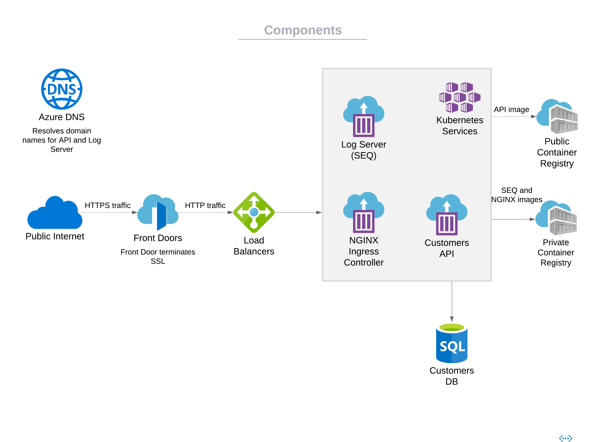

# Microservice template POC

This project provides a template for creating a microservice in Azure. It containts Net API layer, DAL based on EF Core, Helm Chart,
infstracture as a code setup for Azure on Terraform and Bicep.

## Technologies

Net Core 5, Azure SQL, Kubernetes, Helm, Terraform, Bicep 

## Setup

### Local

- Create a DB in MSSQL(https://www.microsoft.com/en-us/sql-server/sql-server-downloads) or Azure SQL(https://azure.microsoft.com/en-us/products/azure-sql/database/).
- Rename appsettings.Development.template.json into appsettings.Development.json. Asp.Net Core adds configuration for a specific environment based on ASPNETCORE_ENVIRONMENT environment variable,
VS is injecting "Development" by default.
- Replace {LOCAL_DB_CONNECTION_STRING} with your DB connection string. Replace SEQ-INGESTION-URL and SEQ-KEY based on SEQ server(https://datalust.co/seq) configuration.
- Start an application using IIS Express, Kestrel or docker-compose

### Remote

Environment will be created in Azure using Bicep(https://github.com/Azure/bicep) or Terraform(https://github.com/hashicorp/terraform). Parts:
- Frontdoor + rules
- AKS + managed identity with appropriate permissions
- Azure SQL server and DB
Componetes diagram is located in "Components" section
Kubernetes resources:
- Microservice API example
- NGINX Ingress Controller
- SEQ server and PVC for permament SEQ disk

#### Bicep

Bicep infrastrucre as a code setup is locatated in the folder "bicep". CommandsSheet.txt contains commands.
Steps:
- Add DNS records for API and SEQ
- Specify params in main.bicep, create an environment,
- Replace configuration variables in the application, build and push an image to ACR
- Deploy kubernetes resources into AKS using ms chart from "charts\ms"

#### Terraform

Terraform infrastrucre as a code setup using Azurerm(https://registry.terraform.io/providers/hashicorp/azurerm/latest) is locatated in the folder "terraform". 
CommandsSheet.txt contains commands.
Steps:
- Add DNS records for API and SEQ
- Create a container with a storage account for storing a remove state file
- Init terraform with the backend-config
- Specify variables in terraform.tfvars, create an environment
- Replace configuration variables in the application, build and push an image to ACR
- Deploy resources into the AKS using ms chart from "charts\ms"

#### CI/CD

Use Azure Devops to automate integration and delivery process. 

**Application code**
- CI should run tests, apply configuration values from a key vault, prepare an image, push to ACR and publish values.yaml for the chart MS
- CD should update the chart MS using the latest image and value file

**Azure environment**
- CI should prepare an artificat which contains the latest infrastrucre as a code setup
- CD should apply the latest artifact using values from a key vault. Add manual review step if necessary

## Architecture

### Components

### Application code organization

- MS.Core is the library of common classes which can be in use in helper libraries(MS.DataAccess and MS.API) 
- MS.DataAccess is the common data access layer based on EF CORE(https://github.com/dotnet/efcore). DAL is organized using UOW, Generic Repository and Specification patters. 
DAL is designed to only expose materialized entities, it formalizes the process of writing entities mapping, provides support for common operation types, but also allow to
create custom repositories. [Brief documentation](/src/MS.DataAccess/README.md). 
- MS.API is the common API library, provides common class for REST API. Capabilities:
  - Input data validation based on FluentValidation(https://github.com/FluentValidation/FluentValidation)
  - Logging using Serilog(https://github.com/serilog/serilog)
  - Generic error handling 
  - Generic response structure
- MS.API.Customers is the microservice itself wich provides an example of REST API. Contains: 
  - CRUD operations with customers, business layer is intentionally skipped for simplicity
  - Swagger documentation
  - Postman collection with API requests
- MS.DataAccess.Tests and MS.API.Tests are test projects which contain unit and integrations tests. Written on XUnit, MOQ and AutoFixture.

For simplisity MS.Core, MS.DataAccess and MS.API added as source code, but should be published as nuget packages.